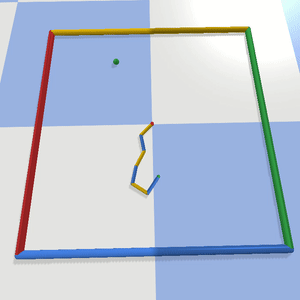

# Reinforcement Learning for the Reacher Link environment
A benchmark of RL algorithms applied to the Reacher Link environment with 2 to 6 joints.



## Installation

```bash
git clone https://github.com/PierreExeter/RL_reacher.git
cd RL_reacher/
conda env create -f environment.yml
conda activate reacher_link
pip install -e .   # Install the Pybullet environment locally
```

## Test installation

```bash
python test_reacher2D.py
python train.py --algo ppo2 --env Reacher6Dof-v0
```


## Tested on

- conda 4.8.3
- Python 3.7
