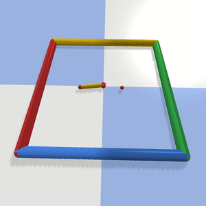
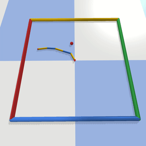

# Reinforcement Learning for the Reacher Link environment
A benchmark of RL algorithms applied to the Reacher Link environment with 2 to 6 joints.


| | | |
|-|-|-|
|  1 joint |  2 joints | 3 joints |
|  4 joints |  5 joints | 6 joints |


## Installation

```bash
git clone https://github.com/PierreExeter/RL_reacher.git
cd RL_reacher/
conda env create -f environment.yml
conda activate reacher_link
pip install -e .   # Install the Pybullet environments locally
```

## Test installation

```bash
cd rl-baselines-zoo/
python 1_test_reacher2D.py
python 2_train.py --algo ppo2 --env Reacher6Dof-v0
```

## Optimise hyperparameters

```bash
./4_optimise_hyperparameters.sh
```
## Run experiments

```bash
./5_run_experiments.sh
```

## Evaluate trained policies

```bash
./6_get_results_exp.sh
```


TO DO NEXT: add evluation metrics (mean reward, success ratio and reach time)


## Tested on

- python 3.7
- conda 4.8.3
